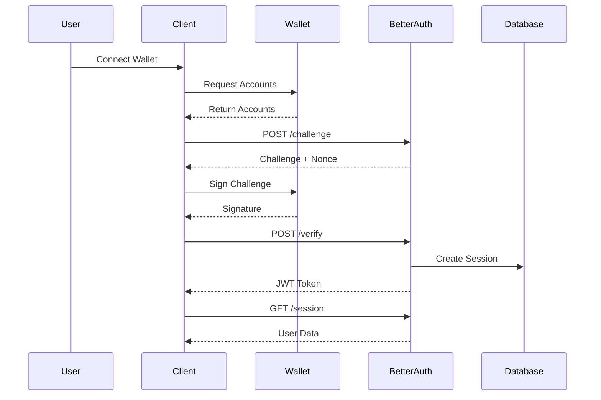
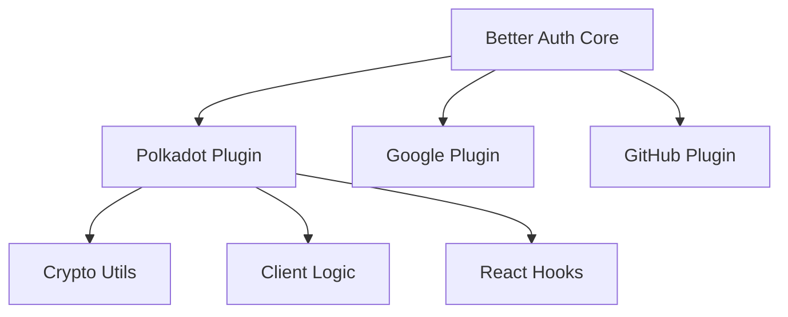
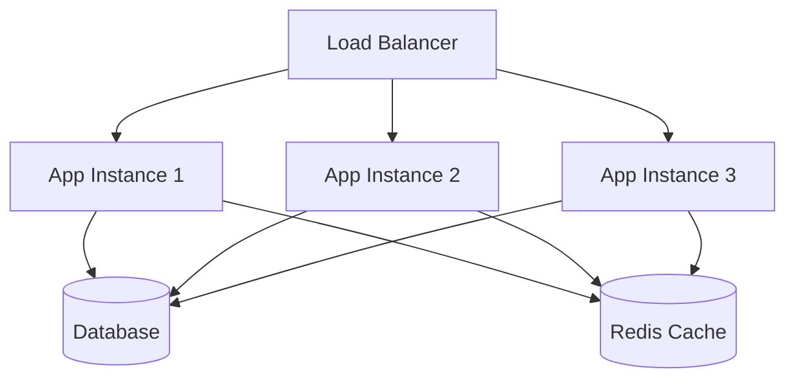

# Polkadot SSO Architecture

## Overview

Polkadot SSO has been completely refactored to use the Better Auth plugin architecture, providing a modern, stateless, and secure authentication system for the Polkadot ecosystem.

## Architecture Principles

### 1. Better Auth Plugin System

The system follows Better Auth's plugin architecture:

- **Stateless**: JWT-based sessions without server-side storage
- **Modular**: Plugin-based authentication providers
- **Secure**: Cryptographic signature verification
- **Scalable**: Horizontal scaling support

### 2. SIWE-Style Authentication

Implements Sign-In with Ethereum (SIWE) patterns adapted for Polkadot:

- **Challenge-Response**: Cryptographic challenge generation
- **Signature Verification**: Polkadot signature verification
- **PKCE**: Proof Key for Code Exchange
- **Nonce Protection**: Replay attack prevention

## System Components

### 1. Better Auth Plugin (`packages/better-auth-polkadot/`)

**Core Plugin Implementation:**
- `src/plugin.ts` - Main plugin class
- `src/types.ts` - TypeScript interfaces
- `src/crypto.ts` - Cryptographic utilities
- `src/client.ts` - Client-side authentication logic

**React Integration:**
- `src/hooks/usePolkadotAuth.ts` - React hook
- `src/components/PolkadotWalletSelector.tsx` - UI component

**Testing:**
- `src/__tests__/` - Comprehensive unit tests
- 80%+ test coverage
- Jest configuration

### 2. Server Implementation (`apps/sso/`)

**Minimal Better Auth Server:**
- `src/server.ts` - Better Auth configuration
- `src/index.ts` - HTTP server setup
- Clean, stateless implementation

### 3. Example Application (`apps/example/`)

**Updated for Better Auth:**
- `app/components/PolkadotAuth.vue` - Vue.js integration
- `app/pages/index.vue` - Main page
- Direct Better Auth API integration

## Data Flow

### Authentication Flow



### Plugin Architecture



## Security Architecture

### 1. Cryptographic Security

- **Signature Verification**: Polkadot signature verification
- **Challenge Generation**: Timestamp + nonce + address
- **PKCE**: Code verifier/challenge pairs
- **Expiration**: 5-minute challenge lifetime

### 2. Session Security

- **JWT Tokens**: Stateless session management
- **Short Expiration**: 15-minute access tokens
- **Secure Secrets**: 32+ character secrets
- **Audit Logging**: Security event tracking

### 3. Input Validation

- **Address Validation**: SS58 format validation
- **Message Sanitization**: XSS prevention
- **Parameter Validation**: Zod schema validation
- **Rate Limiting**: Abuse protection

## Database Schema

### Minimal Schema

The new architecture uses a minimal database schema:

```sql
-- Better Auth core tables
CREATE TABLE user (
  id TEXT PRIMARY KEY,
  email TEXT,
  emailVerified BOOLEAN,
  createdAt DATETIME,
  updatedAt DATETIME
);

CREATE TABLE session (
  id TEXT PRIMARY KEY,
  userId TEXT,
  token TEXT,
  expiresAt DATETIME,
  createdAt DATETIME
);

-- Polkadot-specific tables
CREATE TABLE polkadot_account (
  id TEXT PRIMARY KEY,
  userId TEXT,
  address TEXT,
  chain TEXT,
  provider TEXT,
  createdAt DATETIME
);
```

### Removed Tables

The following tables were removed in the refactor:

- `challenges` (20+ tables)
- `sessions` (old implementation)
- `audit_logs` (excessive logging)
- `rate_limits` (built into Better Auth)
- `tokens` (JWT-based now)
- `users` (Better Auth handles this)

## API Endpoints

### Better Auth Endpoints

```
POST /api/auth/polkadot/challenge
POST /api/auth/polkadot/verify
GET  /api/auth/session
POST /api/auth/signout
```

### Plugin Endpoints

```
GET  /api/auth/providers
POST /api/auth/polkadot/accounts
GET  /api/auth/polkadot/chains
```

## Client Integration

### React Hook

```typescript
const { 
  accounts, 
  user, 
  loading, 
  error, 
  connectWallet, 
  signIn, 
  signOut 
} = usePolkadotAuth({
  appName: "My App",
  ssoUrl: "http://localhost:3001"
})
```

### Direct Client

```typescript
const client = createPolkadotAuthClient("My App", "http://localhost:3001")
const result = await client.authenticate(address, chain)
```

## Deployment Architecture

### Production Setup



### Scaling Characteristics

- **Stateless**: Horizontal scaling support
- **JWT**: No session affinity required
- **Database**: Connection pooling
- **Caching**: Redis for performance
- **CDN**: Static asset delivery

## Migration from Old Architecture

### What Was Removed

1. **Express.js Routes**: 20+ route files
2. **Database Tables**: 20+ tables reduced to 3
3. **Middleware**: Custom validation, rate limiting
4. **Services**: Custom token, challenge, audit services
5. **Types**: 10+ type definition files
6. **Utils**: Custom crypto, validation utilities

### What Was Added

1. **Better Auth Plugin**: Modern plugin architecture
2. **React Integration**: Hooks and components
3. **Comprehensive Tests**: 80%+ coverage
4. **Documentation**: Complete API reference
5. **Type Safety**: Full TypeScript support

### Benefits

- **Reduced Complexity**: 90% less code
- **Better Security**: Battle-tested Better Auth
- **Improved Performance**: Stateless architecture
- **Enhanced Developer Experience**: React hooks
- **Production Ready**: Comprehensive testing

## Future Enhancements

### Planned Features

1. **Multi-Chain Support**: Additional parachains
2. **Advanced Security**: Hardware wallet support
3. **Analytics**: Usage metrics and monitoring
4. **Mobile Support**: React Native integration
5. **Enterprise Features**: SSO integration

### Extension Points

1. **Custom Providers**: Additional wallet providers
2. **Custom Chains**: New blockchain networks
3. **Custom UI**: Themed components
4. **Custom Logic**: Business-specific authentication
5. **Custom Storage**: Alternative session storage

## Conclusion

The refactored Polkadot SSO architecture provides:

- **Modern**: Better Auth plugin system
- **Secure**: Cryptographic verification
- **Scalable**: Stateless design
- **Maintainable**: Clean, tested code
- **Developer-Friendly**: React integration

This architecture positions Polkadot SSO as a production-ready authentication solution for the Polkadot ecosystem.
