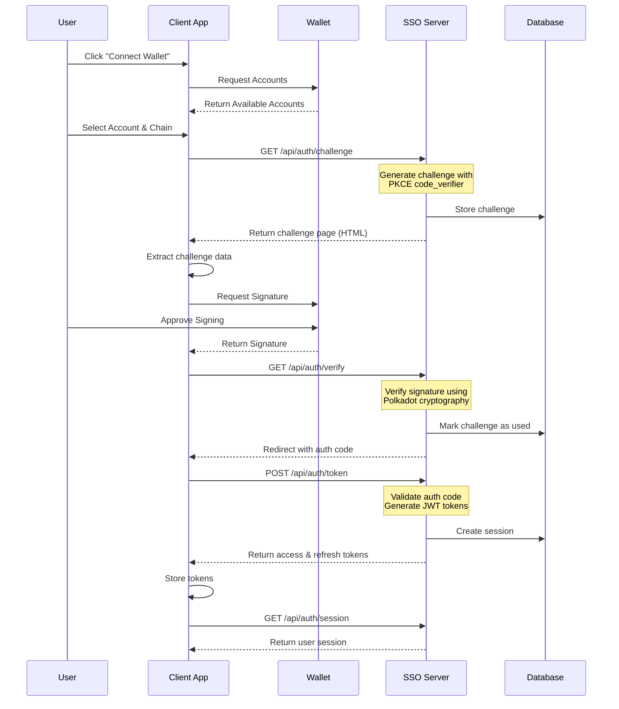

# Authentication Flow

Polkadot SSO implements a SIWE (Sign-In with Ethereum) style authentication flow adapted for the Polkadot ecosystem. This provides a secure, wallet-based authentication mechanism without requiring passwords.

## Flow Overview



## Detailed Steps

### Step 1: Wallet Connection

The user initiates authentication by connecting their wallet:

```typescript
// Client-side wallet connection
import { web3Enable, web3Accounts } from '@polkadot/extension-dapp';

// Enable wallet extensions
const extensions = await web3Enable('My App');

// Get available accounts
const accounts = await web3Accounts();

// User selects an account
const selectedAccount = accounts[0];
```

### Step 2: Challenge Generation

Request a cryptographic challenge from the SSO server:

```typescript
// authService.ts
async createChallenge(address: string, chain: string = 'westend') {
  const response = await fetch(`${SSO_SERVER_URL}/api/auth/challenge?` +
    new URLSearchParams({
      client_id: CLIENT_ID,
      address,
      chain,
    })
  );

  // Server generates:
  // - Unique challenge ID
  // - Message to sign (includes timestamp, domain, nonce)
  // - PKCE code_verifier and code_challenge
  // - State parameter for CSRF protection

  return extractChallengeData(response);
}
```

Server-side challenge generation:

```typescript
// challengeService.ts
async generateChallenge(clientId: string, address: string) {
  const challengeId = generateId();
  const nonce = generateNonce();
  const timestamp = Date.now();

  const message = `Sign this message to authenticate with Polkadot SSO

Challenge ID: ${challengeId}
Account: ${address}
Timestamp: ${timestamp}
Nonce: ${nonce}

This request will not trigger any transaction.`;

  const codeVerifier = generateCodeVerifier();
  const codeChallenge = await generateCodeChallenge(codeVerifier);

  // Store in database with 5-minute expiry
  await db.run(
    'INSERT INTO challenges (...) VALUES (...)',
    [challengeId, address, message, codeChallenge, ...]
  );

  return { id: challengeId, message, code_verifier: codeVerifier };
}
```

### Step 3: Message Signing

The client requests a signature from the wallet:

```typescript
// Client-side signing
import { web3FromAddress } from '@polkadot/extension-dapp';

const injector = await web3FromAddress(address);
const signRaw = injector?.signer?.signRaw;

if (signRaw) {
  const { signature } = await signRaw({
    address: address,
    data: challenge.message,
    type: 'bytes'
  });
}
```

### Step 4: Signature Verification

The SSO server verifies the signature using Polkadot's cryptography:

```typescript
// siweStyleAuthService.ts
async verifySignature(
  signature: string,
  message: string,
  address: string
) {
  const { isValid } = await cryptoWaitReady()
    .then(() => signatureVerify(message, signature, address));

  if (!isValid) {
    throw new AuthenticationError('Invalid signature');
  }

  // Mark challenge as used
  await db.run(
    'UPDATE challenges SET used = 1 WHERE id = ?',
    [challengeId]
  );

  // Generate authorization code
  const authCode = generateAuthorizationCode();

  // Store auth code with 1-minute expiry
  await db.run(
    'INSERT INTO authorization_codes (...) VALUES (...)',
    [authCode, address, clientId, ...]
  );

  return authCode;
}
```

### Step 5: Token Exchange

Exchange the authorization code for JWT tokens:

```typescript
// Client-side token exchange
const tokenResponse = await fetch(`${SSO_SERVER_URL}/api/auth/token`, {
  method: 'POST',
  headers: { 'Content-Type': 'application/json' },
  body: JSON.stringify({
    grant_type: 'authorization_code',
    code: authCode,
    client_id: CLIENT_ID,
    client_secret: CLIENT_SECRET,
    redirect_uri: REDIRECT_URI
  })
});

const {
  access_token,    // JWT access token (15 min expiry)
  refresh_token,   // JWT refresh token (7 days expiry)
  expires_in,      // 900 (seconds)
  token_type       // "Bearer"
} = await tokenResponse.json();
```

Server-side token generation:

```typescript
// tokenService.ts
async generateTokenPair(address: string, clientId: string) {
  const sessionId = generateId();

  const accessToken = jwt.sign(
    {
      sub: address,
      sid: sessionId,
      type: 'access'
    },
    JWT_ACCESS_SECRET,
    { expiresIn: '15m' }
  );

  const refreshToken = jwt.sign(
    {
      sub: address,
      sid: sessionId,
      type: 'refresh'
    },
    JWT_REFRESH_SECRET,
    { expiresIn: '7d' }
  );

  // Store session in database
  await db.run(
    'INSERT INTO sessions (...) VALUES (...)',
    [sessionId, address, accessToken, refreshToken, ...]
  );

  return { access_token: accessToken, refresh_token: refreshToken };
}
```

### Step 6: Using the Session

Make authenticated requests using the access token:

```typescript
// Client-side authenticated request
const response = await fetch(`${SSO_SERVER_URL}/api/auth/session`, {
  headers: {
    'Authorization': `Bearer ${accessToken}`
  }
});

const session = await response.json();
// {
//   user: {
//     address: "5GrwvaEF5zXb26Fz9rcQpDWS57CtERHpNehXCPcNoHGKutQY",
//     chain: "westend",
//     wallet: "polkadot-js"
//   },
//   accessToken: "eyJ...",
//   refreshToken: "eyJ...",
//   expiresAt: "2024-01-01T12:15:00Z"
// }
```

## Security Features

### PKCE (Proof Key for Code Exchange)

Prevents authorization code interception attacks:

```typescript
// Client generates code_verifier
const codeVerifier = generateRandomString(128);

// Server generates code_challenge
const codeChallenge = sha256(codeVerifier);

// Client sends code_verifier with token request
// Server validates: sha256(code_verifier) === stored_code_challenge
```

### CSRF Protection

State parameter prevents cross-site request forgery:

```typescript
// Generate random state
const state = generateRandomString(32);

// Validate state matches on callback
if (callbackState !== originalState) {
  throw new Error('State mismatch - possible CSRF attack');
}
```

### Challenge Expiry

Challenges expire after 5 minutes:

```sql
-- Automatic cleanup of expired challenges
DELETE FROM challenges
WHERE created_at < datetime('now', '-5 minutes');
```

### Rate Limiting

Prevents brute force attacks:

```typescript
// Rate limits per endpoint
const rateLimits = {
  challenge: '10 requests per minute',
  verify: '5 requests per minute',
  token: '5 requests per minute'
};
```

## Error Handling

Common authentication errors and their handling:

```typescript
// Challenge expired
if (challenge.expiresAt < Date.now()) {
  return {
    error: 'challenge_expired',
    message: 'Challenge has expired. Please request a new one.'
  };
}

// Challenge already used
if (challenge.used) {
  return {
    error: 'challenge_used',
    message: 'Challenge has already been used.'
  };
}

// Invalid signature
if (!signatureValid) {
  return {
    error: 'invalid_signature',
    message: 'Signature verification failed.'
  };
}

// Invalid client
if (!clients.has(clientId)) {
  return {
    error: 'invalid_client',
    message: 'Client authentication failed.'
  };
}
```

## Token Refresh Flow

When access tokens expire, use the refresh token:

```typescript
// Client-side token refresh
async refreshAccessToken(refreshToken: string) {
  const response = await fetch(`${SSO_SERVER_URL}/api/auth/token`, {
    method: 'POST',
    headers: { 'Content-Type': 'application/json' },
    body: JSON.stringify({
      grant_type: 'refresh_token',
      refresh_token: refreshToken,
      client_id: CLIENT_ID,
      client_secret: CLIENT_SECRET
    })
  });

  const { access_token, refresh_token } = await response.json();

  // Update stored tokens
  localStorage.setItem('access_token', access_token);
  localStorage.setItem('refresh_token', refresh_token);

  return access_token;
}
```

## Logout Flow

Properly terminate the session:

```typescript
// Client-side logout
async logout() {
  await fetch(`${SSO_SERVER_URL}/api/auth/logout`, {
    method: 'POST',
    headers: {
      'Authorization': `Bearer ${accessToken}`
    }
  });

  // Clear local storage
  localStorage.removeItem('access_token');
  localStorage.removeItem('refresh_token');

  // Redirect to login
  window.location.href = '/login';
}
```