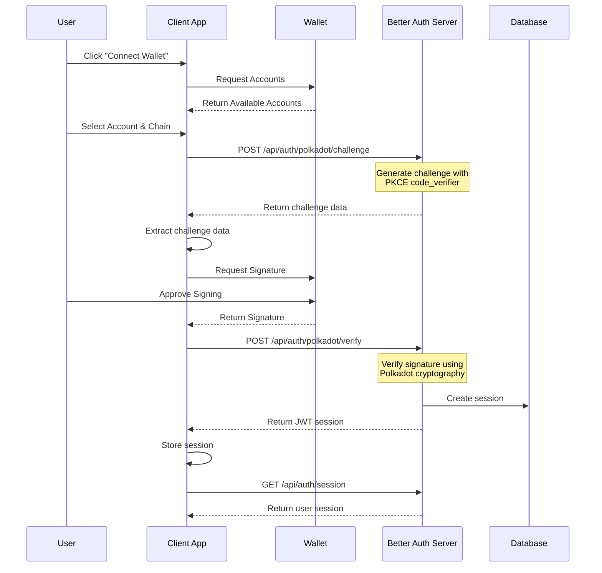

# Authentication Flow

Polkadot SSO implements a SIWE (Sign-In with Ethereum) style authentication flow adapted for the Polkadot ecosystem using Better Auth. This provides a secure, wallet-based authentication mechanism without requiring passwords.

## Flow Overview



## Detailed Steps

### Step 1: Wallet Connection

The user initiates authentication by connecting their wallet:

```typescript
import { web3Enable, web3Accounts } from '@polkadot/extension-dapp'

// Enable wallet extensions
const extensions = await web3Enable('My App')

// Get available accounts
const accounts = await web3Accounts()

// User selects an account
const selectedAccount = accounts[0]
```

### Step 2: Challenge Generation

Request a cryptographic challenge from the Better Auth server:

```typescript
const response = await fetch('/api/auth/polkadot/challenge', {
  method: 'POST',
  headers: { 'Content-Type': 'application/json' },
  body: JSON.stringify({
    address: selectedAccount.address,
    chain: 'polkadot'
  })
})

const challenge = await response.json()
// Returns: { message: string, nonce: string, chain: string, expiresAt: number }
```

### Step 3: Message Signing

Sign the challenge message with the user's wallet:

```typescript
import { web3FromAddress } from '@polkadot/extension-dapp'

const injector = await web3FromAddress(selectedAccount.address)
const signature = await injector.signer.signRaw({
  address: selectedAccount.address,
  data: challenge.message,
  type: 'bytes'
})
```

### Step 4: Signature Verification

Submit the signature for verification:

```typescript
const response = await fetch('/api/auth/polkadot/verify', {
  method: 'POST',
  headers: { 'Content-Type': 'application/json' },
  body: JSON.stringify({
    signature: signature.signature,
    address: selectedAccount.address,
    message: challenge.message,
    chain: 'polkadot'
  })
})

const result = await response.json()
// Returns: { user: PolkadotUser, session: PolkadotSession, token: string }
```

### Step 5: Session Management

The server creates a JWT session and returns user information:

```typescript
interface PolkadotUser {
  id: string
  address: string
  chain: string
  provider: string
  createdAt: Date
  updatedAt: Date
}

interface PolkadotSession {
  id: string
  userId: string
  token: string
  expiresAt: Date
  createdAt: Date
}
```

## Better Auth Integration

The plugin integrates seamlessly with Better Auth's architecture:

### Plugin Structure

```typescript
export const polkadotPlugin = (options: PolkadotPluginOptions): BetterAuthPlugin => {
  return {
    id: "polkadot",
    name: "Polkadot Authentication",
    version: "1.0.0",
    
    onRequest: async (ctx) => {
      // Handle authentication requests
    },
    
    onBeforeRequest: async (ctx) => {
      // Set content type for Polkadot requests
    },
    
    onAfterRequest: async (ctx) => {
      // Audit logging
    }
  }
}
```

### Stateless Architecture

- **JWT Tokens**: Secure session management without server-side storage
- **Challenge-Response**: Cryptographic verification prevents replay attacks
- **PKCE**: Proof Key for Code Exchange for enhanced security
- **Audit Logging**: Comprehensive security event tracking

## Security Features

### Cryptographic Verification

All signatures are cryptographically verified using Polkadot's signature verification:

```typescript
import { signatureVerify } from "@polkadot/util-crypto"

const result = signatureVerify(messageBytes, signatureBytes, address)
return result.isValid
```

### Challenge Generation

Challenges include:
- **Timestamp**: Prevents replay attacks
- **Nonce**: Unique identifier for each challenge
- **Address**: Ensures signature matches the correct account
- **Chain**: Specifies which blockchain network

### Session Security

- **JWT Tokens**: Stateless session management
- **Expiration**: Configurable token lifetime
- **Refresh**: Automatic token refresh mechanism
- **Revocation**: Secure logout and token invalidation

## Error Handling

The authentication flow includes comprehensive error handling:

```typescript
try {
  const result = await authenticate(address, chain)
  // Handle success
} catch (error) {
  if (error.code === 'NO_WALLET') {
    // Handle missing wallet
  } else if (error.code === 'INVALID_SIGNATURE') {
    // Handle signature verification failure
  } else if (error.code === 'CHALLENGE_EXPIRED') {
    // Handle expired challenge
  }
}
```

## Multi-Chain Support

The plugin supports multiple Polkadot ecosystem chains:

- **Polkadot**: Main network with DOT token
- **Kusama**: Canary network with KSM token
- **Westend**: Test network for development
- **Asset Hub**: Parachain for asset management

Each chain has its own:
- **RPC URL**: Network endpoint
- **SS58 Format**: Address encoding
- **Token Symbol**: Native token
- **Decimals**: Token precision